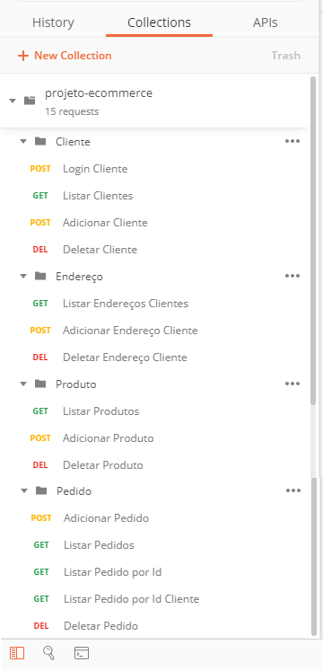
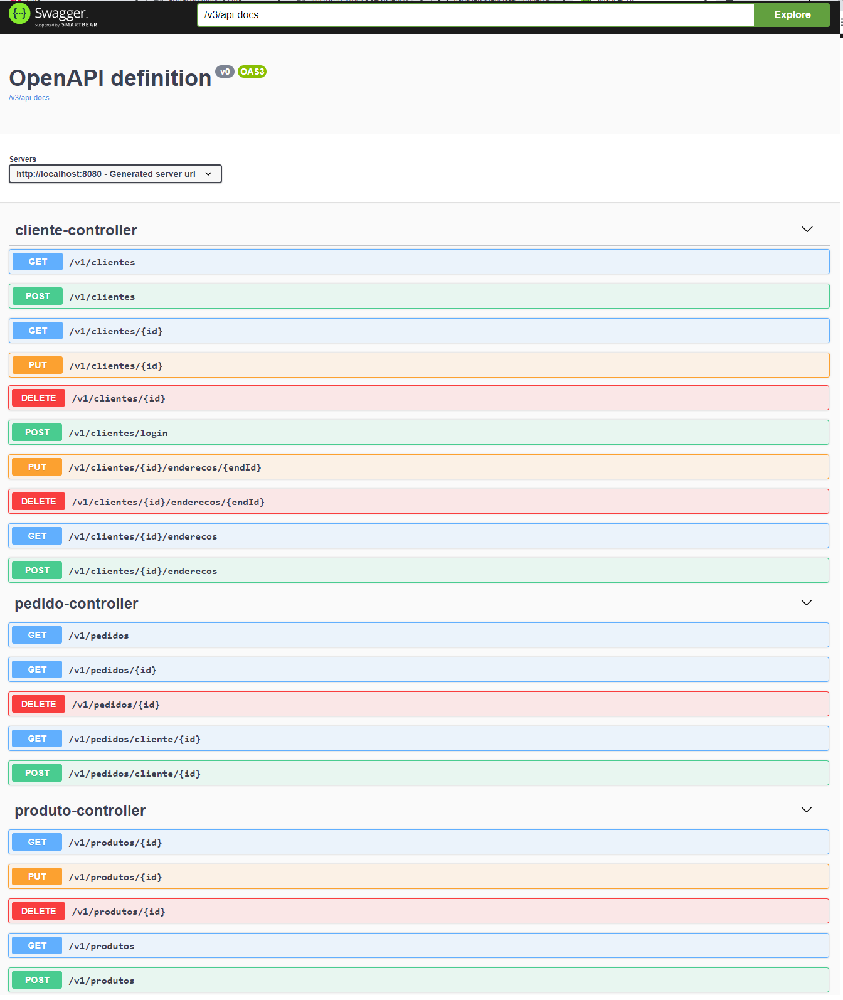
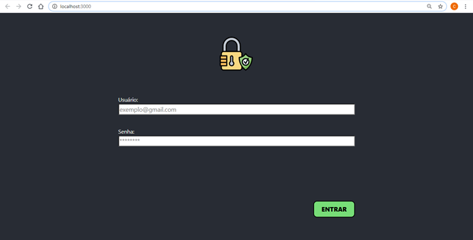
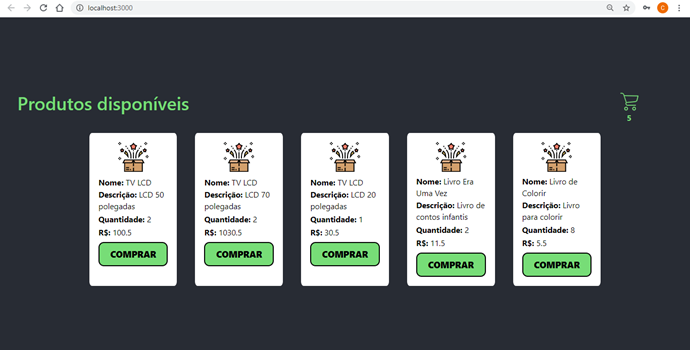
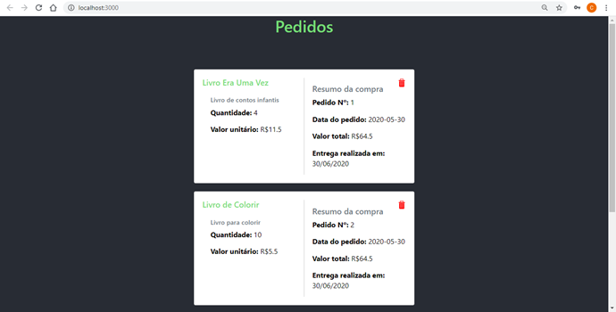
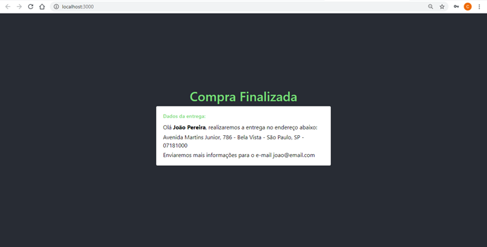

# Projeto E-Commerce FIAP - Turma 35SCJ

## Pré-requisitos para execução da aplicação de transação

Tecnologias necessárias:

  1- Para executar o projeto é necessário ter o JRE 8 ou JDK 8 instalado.
  
  2- Utilizar uma IDE para execução. (Eclipse é recomendado)
  
---

## Componentes utilizados

  - Spring Web
  - Spring Data JPA
  - MySQL
  - Redis
  - Swagger (Documentação)
  
----

## Instalação e execução do projeto


```sh
$ git clone https://github.com/camisbressan/fiap-persistencia-ecommerce.git
```

Após baixar o projeto, acessar a pasta `fiap-persistencia-ecommerce/client` e executar os comandos:

```sh
$ npm install
$ npm start
```

Para iniciar o servidor do Redis acessar a pasta `fiap-persistencia-ecommerce/arquivos_uteis/redis` e clicar em `redis-server.exe`.

Obs.: Para limpar o cache, clicar em `redis-cli.exe` e executar o comando abaixo:

```sh
$ FLUSHALL
```

Para realizar uma carga inicial de cliente, endereço e produto, utilizar:

- Script de banco de dados:
`https://github.com/camisbressan/fiap-persistencia-ecommerce/blob/master/arquivos_uteis/database.sql`

ou 

- Collection do postman com os dados salvos: `https://github.com/camisbressan/fiap-persistencia-ecommerce/blob/master/arquivos_uteis/projeto-ecommerce.postman_collection.json`

Após iniciar o front e o redis, no pacote `br.com.fiap.persistencia.ecommerce` existe um arquivo chamado `EcommerceApplication.java`. Clique com o botão direito e execute em Run.


----

## Funcionalidades Postman



----

## Documentação Swagger



----

## Tela Login



## Tela de Seleção de Produtos



## Tela de Carrinho de Compras



## Tela de Finalização de Pedidos

